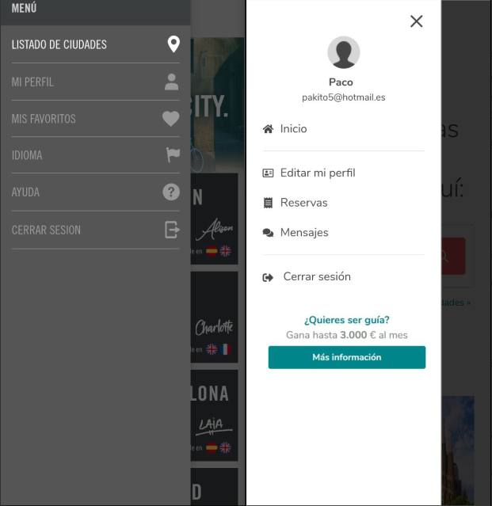
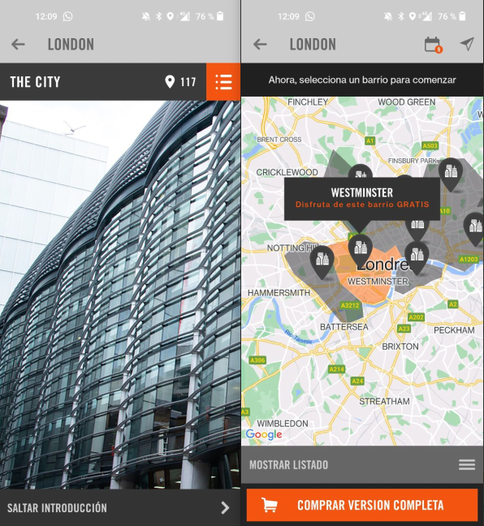
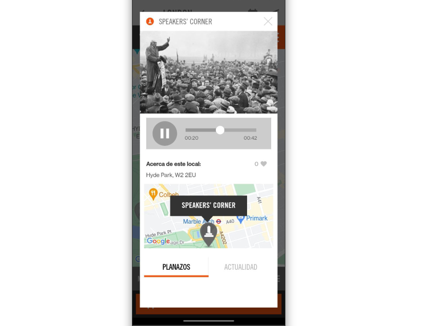
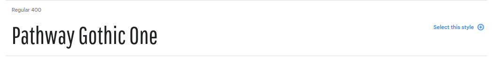
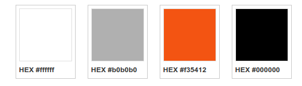
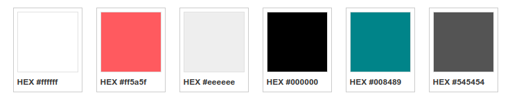

# DIU22-TrabajoFinal
Trabajo Final para la asignatura de Diseño de Interfaces de Usuario UGR

> Realizado por: Francisco Cámara Parra

[TOC]

**PARA UNA MEJOR LECTURA VER EN MI GITHUB:** [https://github.com/quepereza/DIU22-TrabajoFinal](https://github.com/quepereza/DIU22-TrabajoFinal)

## Parte 1: Mi experiencia UX

Antes de este curso no era capaz de analizar una interfaz de usuario de cualquier aplicación o página web, de hecho a penas me fijaba en los detalles de diseño. Como usuario, tenía mi propia experiencia de uso, pero no tenía consciencia sobre ella. 

Este curso me ha ayudado a apreciar los detalles de un buen de diseño, así como a realizar el análisis de la interfaz de una aplicación o web, apreciar sus puntos fuertes y señalar sus débiles. También me ha enseñado a realizar una mejora sobre esos puntos débiles de un diseño, basándome en las necesidades de los usuarios, así como en unos principios básicos de diseño.

Todas estas enseñanzas han sido gracias a las actividades que hemos ido haciendo a lo largo del curso y sobre todo a las prácticas que hemos realizado. Voy a ir comentando cada actividad realizada y lo que me ha aportado a mi aprendizaje sobre IU y UX.

#### Actividades

La primera actividad que realizamos fue una actividad de **etnografía**, que consistía en observar una situación real en la que otra persona trata de realizar una actividad cotidiana y surge algún problema. Evaluamos por qué sucede este problema: un mal diseño, una falta de conocimientos previos o se ha visto influido por el contexto. De esta forma, empatizamos con el usuario mientras realiza una actividad, y vemos los fallos y dudas que le surgen en el proceso. Evaluamos si las dudas son por su estado y contexto, como ir con prisas, o son por un diseño poco intuitivo no accesible a cualquier usuario. Este ejercicio me hizo darme cuenta de la importancia del diseño en nuestra vida cotidiana y de la importancia de empatizar con los usuarios para entender sus necesidades.

Después, realizamos el **análisis de varias páginas webs** en clase por parejas, en el cual destacamos la relevancia de un concepto tan importante como es el del layout de una página, en el cual se incluyen otros conceptos como el esquema de navegación o el wayfinding entre otros. Esta actividad me hizo darme cuenta de lo importante que es la planificación a la hora del diseño de una página, ya que una mala planificación del diseño de una página puede llevar a una mala experiencia de usuario y un mal diseño.

En siguiente lugar, ya avanzado el curso, realizamos un **moodboard**, algo ensencial, en mi opinión, a la hora de realizar un diseño desde cero, ya que nos transmite la inspiración necesaria y permite la planificación en cuanto a estilos y personalidad de no solo nuestro diseño, si no también de nuestro proyecto. 

Luego realizamos un **análisis de usabilidad** comparativo entre tres páginas webs de distintas universidades andaluzas aplicando diversas heurísticas y tests. Así, evaluamos cada página según los mismos criterios generales a toda página web (ayuda, contacto, información del sitio actual, etc) y tests adaptados al tipo de página, midiendo por ejemplo el número de clics necesarios para realizar una acción específica. Esto nos pone directamente en el lugar del usuario, valorando en cada caso la sencillez para hacer acciones usuales (y que, por tanto, deberían ser prioritarias y con un acceso rápido).

Finalmente, realizamos un **análisis de la accesibilidad** de la página de un ayuntamiento, en mi caso elegí el de mi pueblo, la cual tiene bastantes opciones de accesibilidad, con lo cual me pareció una buena elección. Esta actividad me ha parecido de las más importantes ya que, mediante extensiones, pudimos experimentar de primera mano las experiencias de usuarios con diversas dificultades en páginas reales y me hizo darme cuenta de la poca información y lo mal adaptadas que están las páginas en general a las personas con algún tipo de discapacidad. Siempre se destaca la importancia de hacer diseños accesibles e intuitivos a todo el mundo, pero en la mayoría de casos, incluso en páginas institucionales se descuida la información respecto a la adaptación a personas con necesidades especiales de la que se dispone y la propia adaptación de las páginas en sí.

### Prácticas

A la vez que íbamos realizando estas actividades, hemos ido realizando las prácticas de la asignatura, las cuales han tenido como objetivo realizar un análisis de las necesidades los usuarios, aprender a analizar opciones existentes y realizar el desarrollo de un diseño desde cero de una aplicación, así como aprender a realizar comparativas con otros diseños una vez hemos llevado a cabo el nuestro.

Las prácticas realizadas por mi compañero y yo se pueden consultar en: [https://github.com/quepereza/DIU](https://github.com/quepereza/DIU)

Hemos seguido una metodología real para crear paso a paso el diseño de una aplicación desde cero. Durante el desarrollo de las mismas he aprendido a realizar un análisis de competencia, una herramienta muy útil en diversos campos de la informática, que ayuda a poner en contexto de qué quieres realizar y qué requisitos indispensables debe tener tu aplicación, así como qué funcionalidades gustan más a los usuarios.

La temática general de las prácticas han sido los hostels, basado la situación en el impacto de la pandemia en el sector turístico.

En la primera práctica llevamos a cabo un análisis de la usabilidad de las alternativas existentes a un hostel asignado a cada grupo de prácticas, para después crear unas Personas ficticias que nos permiten empatizar con el usuario y llevando a cabo unos Journey maps, los cuales nos permitieron descubrir las necesidades reales de los usuarios.

En la siguiente práctica, estudiamos el importante Diseño Centrado en el Usuario, el cual sitúa a la persona como eje principal del proceso de diseño, en lugar de al producto. En esta parte, se nos plantearon varias alternativas para dar nuestra propuesta de diseño a partir de las necesidades de los usuarios de la práctica anterior, siendo la que mejor me pareció el feedback capture grid, el cual creo que recababa mejor toda la información sobre las necesidades de los usuarios. Después, realizamos un scope canvas, el cual nos permitió concretar nuestro proyecto basándonos en todo lo anterior, para finalmente realizar unos bocetos de nuestra propuesta final, a la cual terminaremos de dar forma posteriormente. En esta práctica aprendí a darle forma a una idea y a concretar los conceptos de nuestro proyecto a partir de las necesidades de los usuarios.

En la práctica 3, al igual que en una de las actividades, realizamos un moodboard, el cual terminó de otorgar la identidad a nuestro proyecto, para posteriormente realizar un prototipado completo de nuestra aplicación (en nuestro caso) usando la herramienta Protopie. También realizamos una landing page, la cual es esencial a la hora del branding de nuestro proyecto. Para mí, el mayor aprendizaje de esta práctica fue aprender a usar la herramienta de prototipado, ya que considero que en el futuro me puede ser muy útil, y también aprendí la importancia del branding en un proyecto.

Por último, una vez realizado nuestro prototipo, en la última práctica aprendimos a compararlo con otro utilizando herramientas como el A/B testing o la realización del cuestionario SUS con personas ficticias y reales. Aquí aprendí que el diseño no acaba cuando tenemos el diseño final, si no que es todo un proceso continuo de revalorizar nuestro trabajo y seguir mejorándolo basándonos en la experiencia de los usuarios.

En conclusión, he aprendido cómo desarrollar una aplicación atendiendo a las necesidades de todos los usuarios, cómo extraer dichas necesidades, clasificando las funcionalidades según prioridad, a realizar tests y evaluaciones de páginas y cómo elegir y definir el concepto de una aplicación, para luego aplicarlo a su prototipo, creando así su imagen de marca de forma correcta según el propósito de tu aplicación.

## Parte 2: Caso de estudio

Vamos a realizar un análisis comparativo entre las dos propuestas que se nos plantean.

La primera propuesta es **GuruWalk**, una aplicación/ página web la cual sigue el modelo de éxito en el mundo turístico conocido como *Free Tours*, los cuales son tours que se realizan por una ciudad de forma que el usuario es el que valora el coste del tour al final de este.

Por otro lado, tenemos una nueva propuesta de valor frente a este modelo, **CityMe**, la cual plantea otro modelo en el que se realiza un tour a través de un guía virtual que te explica la zona en la que te encuentras a través de geolocalización.

Lo primero que vamos a hacer va a ser descargar ambas aplicaciones en nuestro móvil, ya que aunque GuruWalk posee una versión web y una app móvil, CityMe solo posee una versión móvil. Vamos a ir analizando algunos de los aspectos más importantes a la hora de realizar un diseño.

### Necesidades de los usuarios

En primer lugar, nos preguntamos: ¿Qué necesitan los usuarios? Para ello podemos crear una Persona (de forma breve, no usaré la plantilla usada en prácticas para no extenderme demasiado):

#### Persona

> Nombre: Sandra López
>
> Edad: 27
>
> Ocupación: Dependienta en un centro comercial
>
> Residencia: Granada
>
> Familia: Tiene pareja desde hace 7 años
>
> Acerca de: Nació y creció en Granada. Estudió un grado superior de Marketing y al acabar fue trabajando en varias tiendas hasta que la hicieron fija en un Corte Inglés del centro con unas mejores condiciones laborales. Tiene un nivel económico estable al igual que su pareja, con la cual convive desde hace 3 años.
>
> Necesidades: Ahora que ha alcanzado estabilidad laboral con unas buenas condiciones decide viajar a Madrid a ver un musical, ya que le gustan mucho, y aprovechar también para hacer algo de turismo ya que nunca ha visitado la capital.
>
> Manejo tecnológico: Medio

Vamos a realizar un breve journey map, para entender mejor cuáles son las necesidades de nuestra Persona:

#### Journey Map

> 1. Como ahora cobra más dinero puede viajar más y como le gustan mucho los musicales quiere ir a ver alguno en directo.
> 2. Decide viajar a Madrid para ver un musical junto a su pareja y de paso ver la ciudad ya que nunca ha estado de visita turística.
> 3. Reserva en un hostel y compra las entradas para el musical, poniéndose de acuerdo con su pareja en las fechas. 
> 4. Mira en internet zonas famosas para visitar, pero se da cuenta de que es mejor realizar una visita guíada para apreciar mejor los monumentos.
> 5. Su pareja le comenta que últimamente están muy de moda los free tours y pueden probar a realizar alguno.
> 6. Decide buscar alguna plataforma de free tours y encuentra GuruWalk, pero en la publicidad le sale la opción de CityMe, pero al final decide usar GuruWalk, puesto que el modelo de tour virtual no le convence.

Una vez tenemos nuestra Persona creada, observamos que su principal necesidad es encontrar una visita guiada por las zonas más famosas de una ciudad de forma sencilla. Conociendo las necesidades vamos a realizar una comparación en general de los grandes rasgos del diseño de una aplicación.

### Usabilidad

Vamos a comenzar por la **usabilidad** de cada aplicación. Comenzaremos destacando la ubicación del menú principal desplegable y es que en la aplicación de GuruWalk tenemos que pinchar en el logo en la parte superior izquierda para acceder al menú desplegable de la app, mientras que en CityMe aparece con un icono fácil de reconocer como el menú principal.

Por otro lado, en ambas apps, observamos que existe un buen wayfinding, ya que todo momento se nos muestra la sección del menú donde nos encontramos. Respecto a las opciones del menú principal, se ajustan a las necesidades y observamos que a la derecha en la de GuruWalk, se incluye publicidad de la propia aplicación.

Respecto a los tours virtuales en la app de CityMe, la interfaz deja algo que desear. Siempre que volvemos a salir de un tour de una ciudad para cambiar, se nos vuelve a mostrar el video de introducción y podría de alguna forma guardarse si ya hemos visto el vídeo introductorio de la ciudad.

Como vemos en las imágenes, una vez hemos accedido al tour de CityMe, pasando el video introductorio se nos muestra un mapa con los barrios disponibles en la versión gratuita y cada vez que pinchamos en un barrio se nos muestran solamente fotos de las zonas que explican, las cuales tenemos que pasar nosotros manualmente. Para mejorar esto se podría implementar el street view que proporciona google maps, de forma que se muestra automáticamente en visión 360 la zona que se está explicando.

También, cuando accedemos a la explicación de alguna zona en concreto, en primer lugar observamos que hay dos menús vacíos, que son los de "planazos" y "actualizad" en la mayoría de zonas (Si no se puede ofrecer nada, se deberían de ocultar los menús en vez de mostrarlos vaciós). También, mientras que escuchamos la grabación, si nos salimos del menú, el audio se para, con lo cual no podemos seguir explorando otras zonas a la vez que escuchamos un tour.

Por último, comentar que la aplicación de CityMe se queda pillada a veces, sobre todo cuando cambiamos entre la explicación de un sitio a otro y se vuelve al menú de inicio. También destacar, que las opciones gratuitas de los tours son altamente escasas y que deberían añadirse algunas más de prueba, ya que apenas se pueden ver tours de zonas para probar la app.

Respecto a la app de GuruWalk, la interfaz me parece bastante adecuada, de hecho es la versión web adaptada al móvil con un diseño responsivo, lo cual hace que a veces funcione un poco lento al interactuar con algún menú. 

El buscador de GuruWalk es correcto, se pueden ver los free tours disponibles en un mapa del mundo y también buscar en una ciudad concreta. Luego a la hora de hacer una reserva está todo bastante claro, pudiendo elegir una fecha concreta o un rango de fechas y pudiendo también elegir entre una gran variedad de tours distintos o incluso entre diferentes guías para un mismo tour.

### Branding y estética

A continuación, vamos a realizar un breve análisis del branding y la estética de estas propuestas, realizando una comparación entre ellas. En general, la estética de GuruWalk está mucho mejor cuidada que la de la app de CityMe, por varios motivos. Para analizar la página he utilizado la herramienta vista en clase a la hora de hacer el moodboard, [http://stylifyme.com/](http://stylifyme.com/), con la cual he obtenido los elementos principales de la estética.

#### Tipografía

En primer lugar, observamos la tipografía principal, en CityMe es Trade Gothic, la cual es muy parecida a la famosa fuente Impact, la cual está bien pero creo que arrebata la personalidad de la página. 

También creo que se realiza un abuso del uso de esta fuente, ya que se utiliza en casi todos los apartados y subapartados del menú. En su lugar utilizaría tres fuentes tipográficas, una para los títulos en los cuales se quiera llamar la atención (aquí dejaría la que está), otra para los subtítulos, por ejemplo utilizaría Pathway Gothic One (obtenida usando https://fonts.google.com/), la cual es algo más discreta y otra para el texto normal (está también la mantendría).

Respecto a la tipografía de GuruWalk, esta utiliza principalmente la fuente Nunito, la cual no es nada común y otorga personalidad a la aplicación, además tiene una estética uniforme que cuadra con el resto de la aplicación y los colores.

#### Colores

Paleta de colores de CityMe:

Paleta de colores de GuruWalk:

Respecto a la paleta de colores de cada aplicación, en la de la app CityMe encontramos colores apagados y tristes (el naranja solo aparece en la landing page, en la app no se ve), los cuales no creo que sean algo favorable para la estética de la marca, mientras que en la app GuruWalk, encontramos un color principal (el rosita), que resalta bastante y que es fácil de asociar a la marca puesto que no es un color común en los logos. También encontramos otros colores secundarios (como el azul o el gris clarito) que se complementan bastante bien con el principal. 

Realizaría un cambio de los colores de la app CityMe por completo, añadiendo otros colores algo más vivos y llamativos o si la empresa lo prefiriese, dejaría colores apagados y oscuros, pero con algo más de personalidad, no simplemente una paleta de grises y negros.

### Accesibilidad

Por último, vamos a comentar las opciones accesibilidad de cada página, que en este caso es escasa en ambas apps, ya que ninguna tiene opciones disponibles ni para ampliar el texto ni para cambiar el contraste y tampoco para personas con discapacidades auditivas.

Destacamos esta falta de opciones de accesibilidad en la app de CityMe sobre todo, puesto que una ventaja que tiene el modelo free tour es que el usuario se limita a reservar el tour y luego a asistir a él, sin embargo en CityMe el tour se realiza a través de medios electrónicos, lo cual podría suponer una gran dificultad para los usuarios con algún tipo de discapacidad (también para los que tengan un peor manejo de la tecnología).

Mejoraría esto en CityMe añadiendo algo tan básico como es subtítulos en los vídeos introductorios de los tours o algunas transcripciones en las audiodescripciones de cada zona.

### Conclusión

En general, la usabilidad es mucho mejor en la app de GuruWalk que en la de CityMe, también porque la funcionalidad de CityMe es más compleja de llevar a cabo. En cuanto a las opciones de branding y estética, creo que hay claros fallos de planificación a la hora de implementar la estética de CityMe y que con un poco de esfuerzo se podría mejorar bastante y darle un lavado de cara a la app. Finalmente, comentar que creo que las opciones de accesibilidad son importantes y más cuando el target de estas apps es tan amplio como lo es en el sector turístico de los tours.

### 